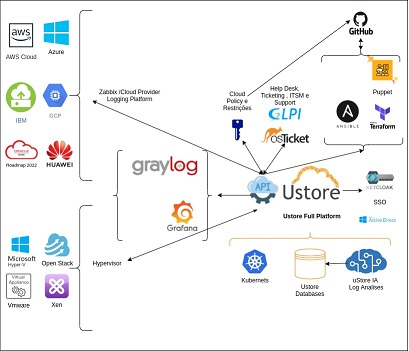

Introdução
==========

As organizações empresariais adotaram a nuvem como solução para gerenciar seus ambientes e adotam uma combinação de nuvens privadas e públicas, o grande desafio atual é o gerenciamento destes ambientes híbridos de diversas nuvens (hybrid multi-cloud) de forma a alcançar uma visão unificada, bem como obter um controle dos custos financeiros de forma centralizada, uma vez que cada organização empresarial tem uma necessidade e enfrenta diferentes desafios. 

A Plataforma do uCloud foi desenvolvida para estes cenários, independente de quantos provedores (públicos e/ou privados) existam, o usuário poderá interagir com suas plataformas de Infraestrutura como Serviço (Infrastructure as a Service – IaaS), Plataforma como Serviço (Platform as a Service – PaaS).
Como mencionado anteriormente, o uCloud está posicionado como uma plataforma de Cloud Service Broker – CSB (broker de serviços em nuvem) que permite gerenciar múltiplos provedores de serviços de nuvem, tanto privados quanto provedores de nuvem pública.

Uma plataforma de CSB como a Plataforma do uCloud permite às organizações atuar em cinco pontos fundamentais para o gerenciamento de ambientes híbridos multi-nuvem, são eles:

Governança Financeira
---------------------

Além do controle da infraestrutura, a Plataforma do uCloud permite que empresas usuárias desta plataforma possam estabelecer limites, tanto financeiros quanto quantitativos de recursos (cotas). Estes limites financeiros ou de infraestrutura, podem ser aplicados em três níveis:

* Para um provedor público em geral (ver o ítem Contratos, no Menu Administração)
* Para um grupo de usuários (ver o item Grupos, no Menu Administração)
* Para um usuário/indivíduo (ver o item Usuários, no Menu Administração)

Desta forma, a organização aplicará critérios de governança financeira e controle de custos, como também poderá acompanhar os custos do seu ambiente híbrido de multi-nuvem através de uma única interface. 

A adoção da aplicação de limites (cotas) financeiros e/ou recursos computacionais em diversos níveis alcança o nível de usuário, assim o controle de custos será efetivo e permitirá evitar que o orçamento da organização seja surpreendida em situações que o custo da infraestrutura computacional seja exorbitante ou acima dos valores pré-estabelecidos.

Outro aspecto da Plataforma do uCloud é a redução de custo de certificação e treinamento dos especialistas, em cada uma das interfaces de cada provedor (público e/ou privado), visto que o emprego de uma interface de uso e gerenciamento único e simples, permite extrair mais produtividade do ambiente do provedor de nuvem. Mesmo que o usuário não tenha treinamento ou certificação no console específico do provedor (público e/ou privado), a Plataforma do uCloud possibilitará ao usuário provisionar um recurso computacional no ambiente desejado de forma simples e fácil.

Billing (Faturamento dos Serviços)
----------------------------------

A Plataforma do uCloud viabiliza às organizações empresariais a informação dos custos recorrentes referente ao uso dos recursos computacionais na(s) operação(ões) em um ambiente híbrido multi-nuvem. Este é apenas um dos pontos que faz parte da prática de Cloud Financial Management - FinOps (Gestão financeira da nuvem).

Importante ressaltar que, individualmente, a Plataforma do uCloud não atende a todos os três pilares da prática de FinOps por default. A Ustore possui outros produtos que podem ser complementares e o conjunto de produtos tem potencial para atuar como um ambiente capaz de englobar e atender a prática de FinOps.

O quesito suportado pelo uCloud é o ponto de Informação (Inform), os outros pontos desta melhor prática de FinOps: a Otimização e a Operação pertencem aos outros produtos do portfólio da Ustore que complementa a Plataforma do uCloud.

Deve-se esclarecer que a Plataforma do uCloud não cria ou gera valores de recursos computacionais, estes valores são gerados nos provedores de nuvem pública dos quais a Plataforma do uCloud extrai (download) o arquivo de billing (faturamento) destes provedores e adiciona estas informações em suas bases de dados internas. Para que, posteriormente, de acordo com os critérios comerciais do contrato possam ser aplicados e estes custos calculados e convertidos para a moeda corrente no Brasil. 

Desta forma, o usuário permanece informado da evolução dos custos e poderá acompanhar se estes custos encontram-se dentro dos critérios da governança financeira da organização.

Geralmente estes custos são apresentados em arquivos de texto não estruturados (Comma-separated Values – CSV) gerados a cada período (média de 8 horas) e a Plataforma do uCloud adiciona a informação deste arquivo CSV para a sua base de dados interna de forma a agilizar e simplificar a apresentação destes valores na tela do usuário.

Exclusivamente, os usuários com um perfil específico podem ‘visualizar custos’ e permanecer informados dos valores de consumo dos seus recursos computacionais totais em cada provedor de nuvem (pública e/ou privada). Isto permite que o usuário possa acompanhar os custos acumulados dos recursos computacionais ativos nos provedores de serviços de nuvem.

Monitoração da Infraestrutura
-----------------------------

Uma funcionalidade importante da Plataforma do uCloud é a recente implementação do módulo de gerência de eventos (monitoração) que permite coletar eventos e alarmes que foram gerados nos ambientes de nuvem (público e/ou privado), ativar notificações e criar relatórios customizados. 

Todas essas facilidades reduzem os custos para as organizações, uma vez que elimina a necessidade de contratação de serviços de monitoração dos provedores, pois tal serviço pode representar altos custos os quais podem impactar de forma negativa no orçamento (ultrapassar o limite) destinado para infraestrutura de nuvem pública. 

Esta funcionalidade permite integrar a um ambiente de gerenciamento de Service Desk para controle IT Service Management (gerenciamento de serviços de TI).

Inventário (Assessment)
-----------------------

A Plataforma do uCloud se conecta aos provedores de nuvem através do cadastramento de credenciais de acesso específicas de cada provedor de serviço de nuvem (público e/ou privado). Para esta finalidade as empresas devem providenciar credenciais de modo “operativo”. 

Esta credencial operativa é fornecida pelo administrador do serviço de nuvem e são credenciais que são geradas nas contas dos provedores que somente tem permissão de interagirem com a console do provedor público de nuvem através de uma API, não são credenciais normais com informações padrão de login e senha. Desta forma, a segurança e as regras de regulamentação de segurança da informação estão previstas e atendidas em sua totalidade.

Uma vez que as credenciais operativas são configuradas na Plataforma do uCloud, a primeira atividade é sincronizar as configurações e o inventário de recursos computacionais existentes no provedor (máquinas virtuais – workloads). Este inventário de máquinas virtuais é extraído e adicionado nas bases de dados do uCloud, de forma que a apresentação na tela do usuário seja rápida.

Com este inventário disponível diretamente dentro da Plataforma do uCloud, o usuário poderá operar cada uma das máquinas virtuais, independente de qual é o provedor de nuvem que este recurso está provisionado. Veja a seguir as possíveis operações a serem aplicadas aos recursos computacionais existentes nos provedores de nuvem (público e/ou privado).

Importante mencionar que a Plataforma do uCloud não possui nenhum recurso computacional, estes recursos existem nas nuvens dos provedores de serviço de nuvem pública ou nos ambientes de virtualização (hypervisors) instalados em seu Data Center privado. Através da API Rest a Plataforma do uCloud, envia ações (tarefas) para o gerenciador de ambiente de nuvem específico (público e/ou privado) para que estes então executem a ação desejada.

O usuário poderá acompanhar o resultado de qualquer uma das ações de operação nos recursos computacionais de forma quase que imediata, vale lembrar que não é a Plataforma do uCloud que executa as ações, e sim, o ambiente onde a máquina virtual existe (seja ele público e/ou privado). Este é o encarregado de executar a tarefa enviada através da API Rest. 

Caso o resultado não seja refletido na interface da tela do usuário, o console destino pode levar um certo tempo para executar esta tarefa e somente após o término da execução da tarefa o resultado será apresentado na interface do uCloud. 

Existe uma opção de menu onde o usuário poderá acompanhar o percentual de andamento destas tarefas, seu resultado de sucesso ou a mensagem de erro referente a alguma restrição do ambiente destino. 

Importante ressaltar que podem existir restrições aplicadas ao usuário provisionado na Plataforma do uCloud, restrições ao usuário porque ele pode haver exaurido seu limite, sua cota financeira ou de recursos computacionais, desta forma a Plataforma do uCloud gerar um aviso de erro: “limite de cota excedido” por exemplo. Estes cenários serão descritos no menu Tarefas.

Operação da Infraestrutura
--------------------------

A menção operar significa ao leitor que é a capacidade do usuário comandar certas ações diretamente nestas máquinas virtuais, como ações de: parar (shutdown), reiniciar (restart), suspender (suspend), remover (delete), para citar algumas operações básicas.

Através da interface da Plataforma do uCloud, o usuário pode enviar comandos para os consoles de cada provedor de nuvem, além das ações acima listadas. Este também pode visualizar as informações das configurações específicas da máquina virtual, bem como alterar ou adicionar algum recurso extra a esta máquina virtual (por exemplo: placa de rede, disco, grupo de segurança, snapshot, entre outros).

Em relação aos provedores de serviço de nuvem pública, a Plataforma do uCloud está preparada para se conectar com as seguintes plataformas de nuvem pública:

* Amazon Web Services (AWS)
* Google Cloud Plataform (GCP)
* Microsoft Azure
* IBM Cloud
* Huawei Cloud
* Oracle Cloud Infrastructure (OCI)[1]

Atualmente, a Plataforma do uCloud está preparada para se conectar com as seguintes plataformas (hypervisors) de gerenciamento de ambiente de nuvem privada:

* VMware (vCenter Versões 5.0, 5.1, 5.5, 6.0, 6.5, 6.7);
* vCloud
* Hyper-v (Windows 2008R2, Windows 2012, Windows 2012R2 e Windows 2016)
* Openstack 
* Xen Server 
* XCP-NG
* KVM

A Plataforma do uCloud, além das funções de CSB (*Cloud Service Broker*), também é um agregador de funcionalidades que permite aos usuários, de forma simples e centralizada, o controle de diversos consoles de gerenciadores de ambientes virtualizados (*hypervisors*) seja do ambiente privado on-premises quanto do ambiente de fornecedores de nuvem pública. Agrega as funcionalidades de monitoração, fluxo de trabalho na nuvem (*Cloud Workflow*) e possibilita implementar um repositório biblioteca centralizado de arquivos (playbooks) de referência para uso de ferramentas de infraestrutura como código (*Infrastructure as a Code*).

Integração e Interoperabilidade entre Plataformas (*API Ucloud*)
--------------------------------------------------------------

Interoperabilidade é a habilidade de dois ou mais sistemas (computadores, meios de comunicação, redes, software e outros componentes de tecnologia da informação) de interagir e de intercambiar dados de acordo com um método definido, de forma a obter os resultados esperados. Interoperabilidade define se dois componentes de um sistema, desenvolvidos com ferramentas diferentes, de fornecedores diferentes, podem ou não atuar em conjunto.

A comunicação entre estes 'sistemas' se baseia no consumo de uma interface de programação de aplicação (API) que possibilita o envio e recebimento de chamadas para execução de alguma atividade ou extrair de algum tipo de informação armazenada.  A sigla API deriva da expressão inglesa Application Programming Interface que, traduzida para o português, pode ser compreendida como uma interface de programação de aplicação. Ou seja, API é um conjunto de normas que possibilita a comunicação entre plataformas através de uma série de padrões e protocolos.

Por meio de APIs, desenvolvedores podem estabelecer comunicação (interoperabilidade) entre softwares e aplicativos capazes de se comunicar com outras plataformas.

O principal exemplo é a integração nativa e direta da Plataforma do uCloud com a console dos provedores de nuvem pública, toda esta é executada através da interoperabilidade via API dos  consoles dos provedores.

Outro exemplo bastante comum do uso da plataforma uCloud é a emissão de invoices de bilhetagem para sistemas de showback e chargeback, bem como o envio de informações e alertas sobre recursos gerenciados.

Nossos clientes (e/ou integradores) podem utilizar a documentação da API da Plataforma do uCloud com suas plataformas internas, de forma a complementar ou automatizar certas atividades ou ações que estão além das capacidades nativas da Plataforma do uCloud. Por exemplo: consultar e extrair da Plataforma do uCloud o custo da fatura dos valores de um provedor de nuvem pública através de uma aplicação financeira/contábil para a emissão da Nota Fiscal.

A Plataforma do uCloud possui uma documentação da sua API, mas o acesso a documentação completa deve ser solicitada à Equipe de Atendimento ao Cliente (contato@usto.re) para que seja criada e enviada uma credencial de acesso à documentação da Plataforma do uCloud.
A Equipe Ustore está preparada para auxiliar e avaliar as demandas de interoperabilidade e integração entre a Plataforma do uCloud e as plataformas que possuem e permitem o uso de API’s para a interoperabilidade.

Arquitetura de Referência da Plataforma do uCloud
-------------------------------------------------

Abaixo apresentamos uma arquitetura de referência para a Plataforma do uCloud com os seus componentes, os provedores e as integrações nativas.

    Arquitetura e Referência da Plataforma uCloud

A Plataforma do uCloud se comunica com o console dos provedores através da API Rest, assim toda ação executada ou configurada nas telas do uCloud envia ações (tarefas) para o gerenciador de ambiente (console) de nuvem específico (público e/ou privado) para que estes possam executar a ação desejada. A Ustore tem o compromisso de manter o desenvolvimento constante das suas Plataformas de Software e aplicar as melhores práticas (best practices) de DevOps vigentes no mercado de TI, na atualidade. Nosso compromisso versa na manutenção da compatibilidade de integração para que as mais recentes mudanças e implementações no console dos provedores, e de todos os softwares com os quais mantemos interoperabilidade, de forma que as novas funcionalidades estejam sempre disponíveis através da interface da Plataforma do uCloud. Utiliza-se um conjunto de práticas e ferramentas projetadas para aumentar a capacidade de uma organização fornecer aplicativos e serviços mais rapidamente do que os processos tradicionais de desenvolvimento de software.